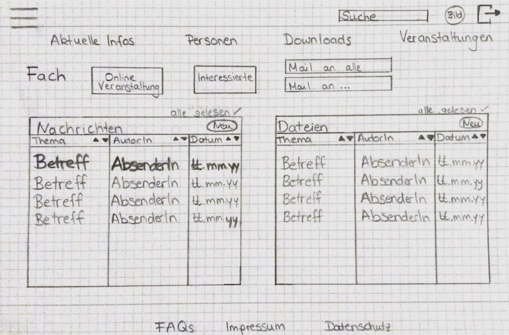

# Aufgabe 2.2 - Konzeptentwurf

## Startseite

Das Intranet soll für Studierende und Lehrende übersichtlich und kompakt gestaltet sein. Das Dashboard kombiniert den Stundenplan, Mails, Übersicht über die gebuchte Veranstaltungen und die Mensa. Häufig genutze Menüpunkte stehen im Header, weitere Unterseiten findet man im Burger-Menü.

## Kursseite

Die Kursseite soll die Kommunikation zwischen Studierende und Lehrende vereinfachen und auf einem Blick kenntlich machen. 
Wenn man auf den Modulnamen klickt kommt man auf die Kursbeschreibung. Der Button "Online Veranstaltung" führt zum alfaview Link und "Interessierte" listet die teilnehmenden Studierende auf. Studierende können Mails an alle und an den/die DozentIn schicken, während Lehrende ebenfalls an alle und an einzelne Studierende Mails verschicken können. Man sieht neue Nachrichten und Dateien auf einem Blick und durch drücken auf "Neu" kann man neue Inhalte hochladen. Diese Schaltfläche ist für Studierende nur bei Nachrichten zu sehen, für Lehrende ebenfalls bei Dateien. 

