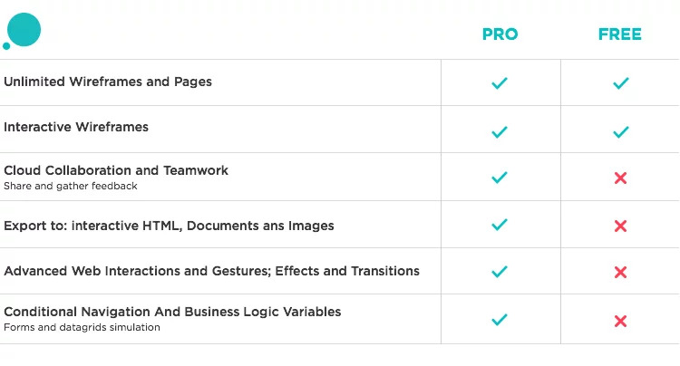

#Aufgabe 02 - Prototyping-Tool

## Tool: Justinmind  
**Bearbeitet von Anastasia Hirt und Elena Faller**

## Allgemeine Beschreibung

[Justinmind](https://www.justinmind.com/) ist ein Prototyping Tool für interaktive Anwendungen. Man kann durch die Drag and Drop-Funktion einfache Wireframes bis hin zu sehr interaktiven Prototypen für Web- und mobile Anwendungen konzipieren. Es unterstützt dabei alle Devices und responisve Design mit Touch-Funktion. Zudem hat man die Möglichkeit Flowcharts und Sitemaps zu erstellen. Justinmind bietet eine umfangreiche UI-Bibliothek, in welcher unter anderem User-Icons, Buttons, Platzhalter-Bilder und vieles mehr vorhanden ist. Die UI-Elemente lassen sich dabei ganz leicht in ihrer Größe ändern. Des Weiteren bietet das Tool die Funktion von flüssigen Layouts, in welcher Elemente neue Screen-Devices einfach übernehmen und so responsiveness leicht abbildbar ist. Zudem hat man die Möglichkeit interaktive Elemente einzubauen und so Events und Interaktionen wie beispielsweise Button oder Link Klicks zu verdeutlichen. Auch Formulare und Listen mit Daten lassen sich interaktiv darstellen und so sofort testen. Durch die praktische Funktion, Projekte und Prototypen mit anderen Nutzern zu Teilen, ist paralleles Arbeiten im Team leicht möglich.

Quelle: [Justinmind.com](https://www.justinmind.com/)

## Fidelity

Justinmind bietet High-Fidelity für die 3 Ebenen Interaktivität, Visualität und Content. Durch Events wie onPageLoad oder onPageUnload können Interaktionen auf Websites oder Apps beispielhaft verdeutlicht werden. Auf der visuellen Ebene bietet das Tool einige Möglichkeiten und eine große UI-Bibliothek, in welcher viele Elemente bereits vorhanden und durch wenige Klicks auf das jeweilige Projekt anpassbar sind. Des weiteren lässt sich klassischer Content wie Texte auf Webseiten beliebig anpassen und einfügen.

Quelle: [dribbble.com](https://www.dribbble.com/)

## Komplexität

Durch die strukturierte Ansicht und Ebenenfunktion hat man einen guten Überblick über alle Funktionen der Anwendung. Die Bedienung erfolgt dadurch intuitiv. Jedoch sollten erste Erfahrungen mitgebracht werden, damit alle Funktionen, die Justinmind bietet, komplett ausgeschöpft werden können.

## Grenzen

Es besteht zwar die Möglichkeit, verschiedene Events für interaktive Anwendungen zu benutzen, diese sind jedoch weitgehend begrenzt. Hier fehlen unter anderem Event-Trigger wie beispielsweise onChange. Außerdem sind die Ladezeiten, vor allem beim Öffnen eines Projektes, verhältnismäßig lange. Die Nutzung aller Funktionen des Tools ist zudem kostenpflichtig.

Quelle: [Justinmind.com](https://www.justinmind.com/)
